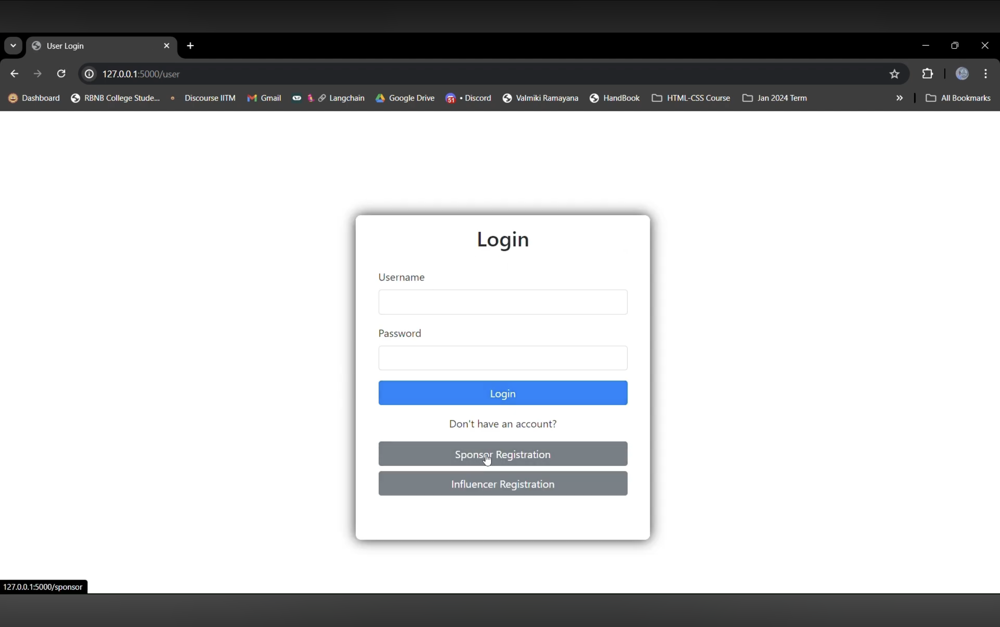
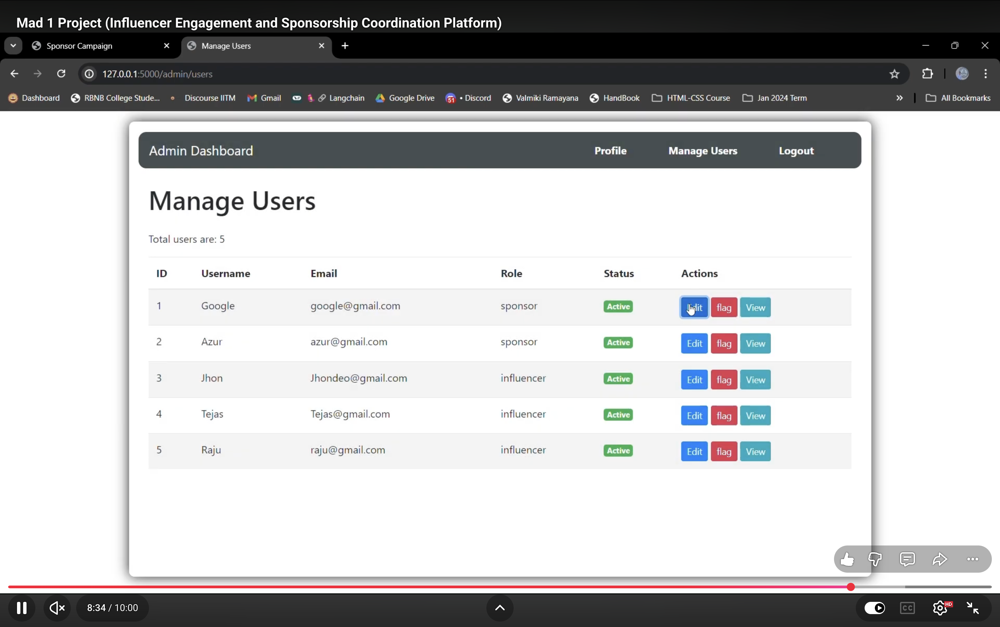
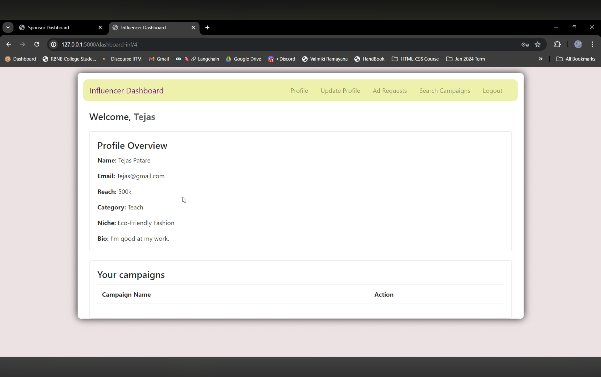

# IESCP Version 1 - Influencer Engagement and Sponsorship Coordination Platform

A basic full-stack web application built using Flask, Jinja2 templates, HTML, and Bootstrap for managing influencer sponsorship campaigns and ad requests.

This was the first version of the Influencer Engagement and Sponsorship Coordination Platform focused on learning CRUD operations, authentication, and backend development fundamentals.

---

## Overview

IESCP Version 1 was developed as part of the IIT Madras BS Degree coursework to understand the fundamentals of full-stack web development using Flask.

The platform allows sponsors to create campaigns and send sponsorship requests to influencers, while influencers can manage collaborations and campaign participation.

The main goal of this project was to learn backend routing, database management, template rendering, and CRUD operations in a real-world style application.

---

## Features

### Authentication & Authorization
- User registration and login
- Role-based access control
- Separate access for:
  - Admin
  - Sponsor
  - Influencer

### Sponsor Features
- Create campaigns
- Update campaign details
- Delete campaigns
- Create ad requests for influencers

### Influencer Features
- View campaigns
- Accept or reject sponsorship requests
- Manage influencer profile

### Admin Features
- Monitor users and campaigns
- Flag inappropriate users or campaigns

### CRUD Operations
- Create
- Read
- Update
- Delete

Implemented for:
- Campaigns
- Ad requests
- User profiles

---

## Tech Stack

### Backend
- Flask
- Flask-SQLAlchemy

### Frontend
- HTML
- Bootstrap
- Jinja2 Templates

### Database
- SQLite

---

## Project Structure

```text
IESCP/
├── static/
├── templates/
├── models/
├── routes/
├── app.py
└── database.sqlite3
```

---

## Screenshots

### Login Page


### Admin Dashboard


### Influencer Dashboard


---

## Core Functionalities

### Campaign Management
Sponsors can:
- Create campaigns
- Edit campaign details
- Delete campaigns
- Manage sponsorship requests

### Ad Request System
Sponsors can send ad requests to influencers with:
- Requirements
- Payment information
- Campaign details

Influencers can:
- Accept requests
- Reject requests
- View ongoing collaborations

### Role-Based Access
The platform supports multiple user roles with restricted access and separate dashboards.

---

## Challenges I Faced

One of the biggest challenges was understanding how Flask routing, database relationships, and template rendering work together in a full-stack application.

Managing multiple user roles and implementing CRUD operations for campaigns and ad requests helped me improve my understanding of backend logic and database design.

This project also improved my debugging skills while handling form submissions and database operations.

---

## What I Learned

- Flask application structure
- CRUD operation implementation
- Jinja2 template rendering
- Database relationship handling
- Authentication basics
- Backend routing
- Bootstrap UI integration
- Role-based access control

---

## Installation

### Clone Repository

```bash
git clone <repo-url>
cd IESCP
```

### Create Virtual Environment

```bash
python -m venv venv
source venv/bin/activate
```

### Install Dependencies

```bash
pip install -r requirements.txt
```

### Run Application

```bash
python app.py
```

---

## Future Improvements

- REST API integration
- Vue.js frontend migration
- Real-time notifications
- Background task processing
- Redis caching
- Better dashboard analytics

---

## Contributors

- Tejas Patare
